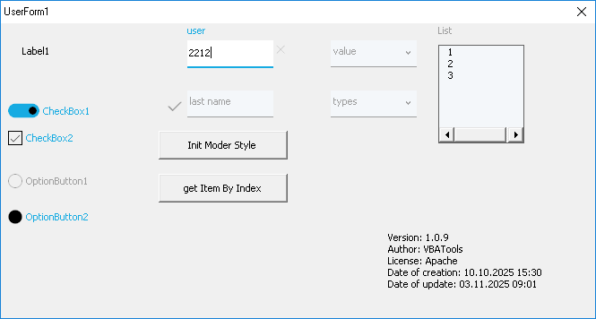

# VBA Modern Style Class



A VBA class library that provides modern styling for MSForms controls in Excel applications. This class enhances the appearance of UserForms with contemporary design elements, animations, and improved visual feedback.

## Features

- **Modern Design**: Apply sleek, contemporary styling to various MSForms controls
- **Focus Animation**: Visual feedback when controls gain focus with animated elements
- **Color Customization**: Configure colors for different control states (active/inactive)
- **Icon Support**: Add icons to controls using the Segoe MDL2 Assets font
- **Clear Buttons**: Automatic clear buttons for textboxes and combo boxes
- **Toggle Switches**: Modern toggle switch styling for checkboxes and option buttons
- **Responsive Labels**: Labels that animate when controls receive input

## Supported Controls

- TextBox
- ComboBox
- ListBox
- CheckBox
- OptionButton
- Frame
- Label
- CommandButton

## Installation

1. Download the `clsModernStyle.cls` file from the `vba-files/Class/` directory
2. Import the class into your VBA project
3. Ensure you have the Microsoft Forms 2.0 Object Library referenced in your project

## Usage

```vba
' Create an instance of clsModernStyle class
Dim style As New clsModernStyle

' Initialize the styling for your UserForm
style.Initialize Me ' where Me is the UserForm

' The class automatically applies modern styling to all compatible controls on the form
```

### Advanced Usage with Custom Colors

```vba
' Initialize with custom colors
Dim style As New clsModernStyle
style.Initialize Me, _
    ColorBarTitleOn:=RGB(0, 100, 200), _
    ColorBarTitleOff:=RGB(120, 120, 120), _
    ColorBarBottomOn:=RGB(0, 100, 200), _
    ColorBarBottomOff:=RGB(180, 180, 180), _
    ColorBackGroundOn:=RGB(255, 255, 255), _
    ColorBackGroundOff:=RGB(245, 245, 245)
```

### Creating Toggle Switches

To create a toggle switch instead of a regular checkbox, set the Tag property of the control to "SWITCH":

```vba
' In the UserForm designer, set the Tag property of a CheckBox to "SWITCH"
' Or programmatically:
MyCheckBox.Tag = "SWITCH"
```

## Icons

The class includes an enumeration of icons that can be used with controls:

- ArrowOff, ArrowOn (for dropdowns)
- CheckBox1, CheckboxComposite, CheckboxFill
- CheckMark
- CircleFill, CircleRing (for option buttons)
- FavoriteStar, FavoriteStarFill
- Heart, HeartFill
- PasswordChar
- RadioBtnOff, RadioBtnOn
- ToggleOff, ToggleOn, ToggleThumb

## Customization Options

The class allows customization of:

- Font sizes for active and inactive states
- Colors for various control elements
- Character sets for different control types
- Visibility and enabled state of controls

## Version

- Version: 1.0.8
- Creation Date: 10.10.2025 15:30
- Update Date: 01.11.2025 09:59
- Author: VBATools

## License

This project is licensed under the Apache License 2.0 - see the [LICENSE](LICENSE) file for details.

## Dependencies

- Microsoft Forms 2.0 Object Library
- VBA (Visual Basic for Applications)

## Examples

The repository includes a test form (`frmTest.frm`) demonstrating the capabilities of the class. You can use this as a reference for implementing the styling in your own projects.

## Accessing Individual Controls

The clsModernStyle class provides methods to access individual styled controls:

- `getItemByIndex(index As Integer) As clsModernStyle` - Returns a control style object by its index position
- `getItemByName(Name As String) As clsModernStyle` - Returns a control style object by its name

These methods allow you to programmatically modify the appearance or behavior of specific controls after the initial styling has been applied.

## Additional Properties

The class also provides the following properties for managing and retrieving information about styled controls:

- `Count As Byte` - Returns the total number of styled controls in the collection
- `Items As Collection` - Returns the collection of all styled control objects
- `Version As String` - Returns version information about the clsModernStyle class

## Setting Title Text via ControlTipText

You can set the title text that appears above controls by using the `ControlTipText` property of your form controls. The clsModernStyle class automatically uses this property to display titles:

```vba
' Set the ControlTipText property in your UserForm controls
MyTextBox.ControlTipText = "Enter your name"
MyComboBox.ControlTipText = "Select an option"
MyCheckBox.ControlTipText = "Agree to terms"

' When you initialize the style, the ControlTipText will be used as the title
Dim style As New clsModernStyle
style.Initialize Me
```

The title will appear above the control when it receives focus and will animate to a smaller size and move to the top-left corner when the control has content.

## Setting Icons

You can set icons for controls by using the `Tag` property of your form controls. The clsModernStyle class uses this property to display icons:

```vba
' Set the Tag property to an icon constant from the enumIcons enumeration
MyTextBox.Tag = 59193  ' Using numeric value for icon
' Or use the enum value if available in your VBA environment
MyComboBox.Tag = "61735"  ' Using string value for icon

' When you initialize the style, the Tag will be used as the icon
Dim style As New clsModernStyle
style.Initialize Me
```

The icon will appear to the left of the control. You can use any of the icon constants defined in the `enumIcons` enumeration in the clsModernStyle class. Icons are displayed using the Segoe MDL2 Assets font.